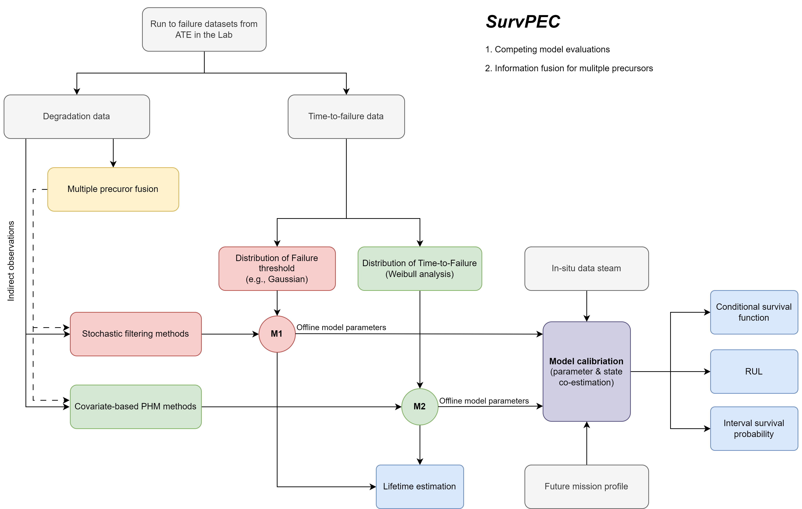

# SurvPEC

## Overview

Real-time assessment of reliability and remaining useful life for power electronics systems

The toolbox covers the below key and fragile components:

- Power semiconductors 
- Capacitors

The toolbox provide the below functions:

1. Real-time remaining useful life prediction for device subjected to in-situ condition condition monitoring
2. System-level applications with multiple failure precursors
3. Exemplary case studies for power semiconductors and capacitors, that can be interactively operated and checked.
4. Reliability assessment for the accelerated testing experiments

The toolbox integrated state-of-the-art artificial intelligence tools and the powerful statistical & stochastic methods, which are specifically tailored for the power electronics applications with very limited, noisy, complex affecting factors, multiple system-level signals, etc. 

## Key features

- Data-driven framework that combined the laboratory testing and the in-situ condition monitoring signal for real-time health assessment.
- Applicable to limited data: data-light applications.
- Explainable, robust, and computationally light data-driven pipeline.
- Hands-on case studies from two representative applications, i.e., the RUL prediction for power module (IGBTs) and Capacitors. 

## Information flow of the SurvPEC toolbox

## Online and offline Datasets

### 1. Offline datasets from laboratory testing

Generally, the offline datasets refer to the testing dataset from the laboratory, via accelerated testing experiments. Many stressors are considered, e.g., temperature, humidity, current, voltage, etc. In this way, the power electronics units can be quickly run to failure due to the accelerated stressors. These information are particularly useful for 

- Investigate the lifetime (MTTF) of the power electronics units.
- learning the degradation patterns and models parameters for the baseline models.
- learning the sensor noise information (e.g., the variance $\sigma^2$ for the signals ).

In the SurvPEC, the offline datasets are formatted as follows. 

@Jian Gao

### 2. Online data streams from condition monitoring

The online data streams are collected from the in-field condition monitoring, which is generally collected from the hardware sensors. These data stream is the key for calibrating the model and individualized the baseline model for the specific ***in-situ*** power electronics units. Usually, there are multiple channel signals for the online data stream. The online dataset are specifically useful for

- updating the baseline model for the individualized model for in-situ unit.

In the SurvPEC, the online data streams are formatted as follows. 

@Jian Gao

